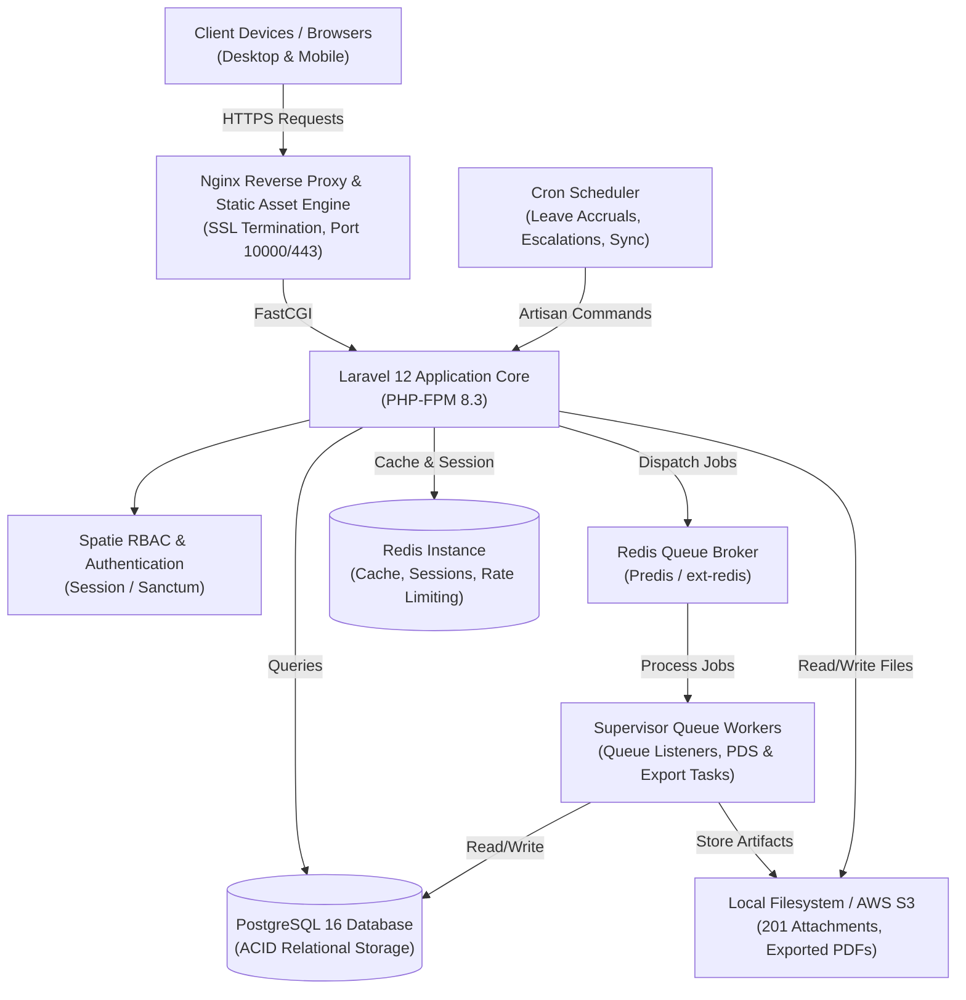
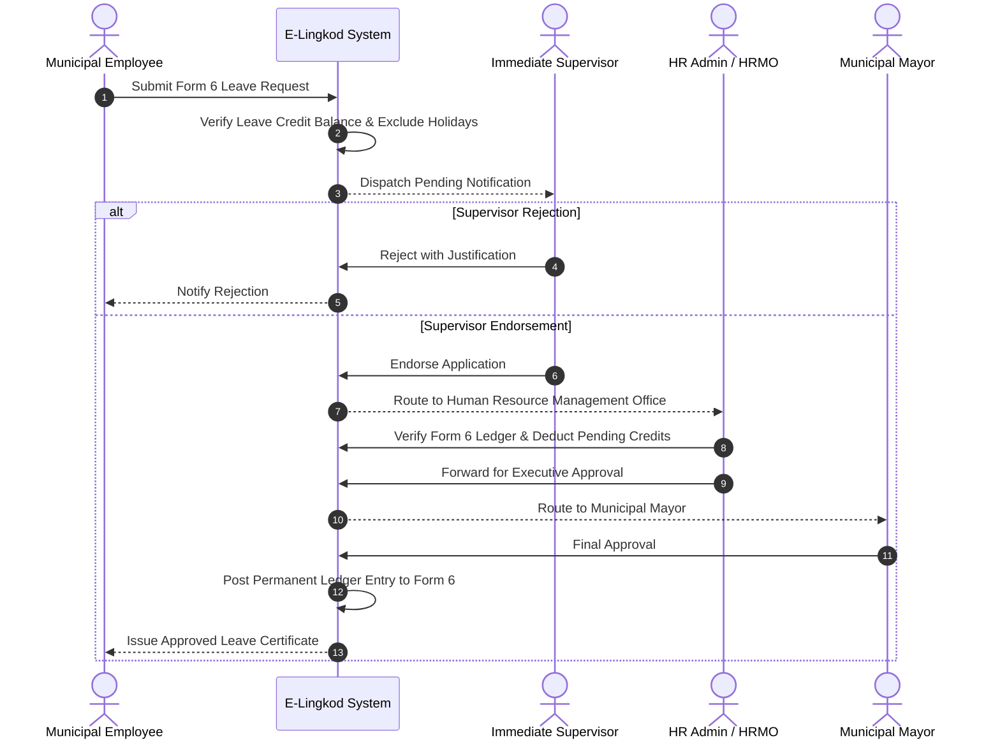

# E-Lingkod Dasol

**Municipal Human Resource Information and Strategic Performance Management System**  
*Local Government Unit of Dasol, Province of Pangasinan, Republic of the Philippines*

---

[](https://elingkod-dasol.work)
[](https://php.net)
[](https://laravel.com)
[](https://postgresql.org)
[](https://redis.io)
[](https://tailwindcss.com)
[](https://alpinejs.dev)
[](https://docker.com)
[](https://csc.gov.ph)
[](LICENSE)

---

**Production Application**: [https://elingkod-dasol.work](https://elingkod-dasol.work)

---

## Executive Summary

E-Lingkod Dasol is a centralized, enterprise-grade Human Resource Information System (HRIS) and Civil Service Commission (CSC)-compliant Strategic Performance Management System (SPMS) architected specifically for the Municipal Government of Dasol, Pangasinan. 

The platform modernizes public sector human resource operations by unifying employee 201 records, statutory leave administration, government benefit compliance, and merit-based performance appraisal into a secure, auditable, and automated digital ecosystem. Engineered with Laravel 12, PostgreSQL, Redis, and Tailwind CSS, E-Lingkod Dasol establishes institutional transparency, operational efficiency, and strict regulatory adherence across all municipal offices.

---

## Table of Contents

- [Executive Summary](#executive-summary)
- [Key Architectural Modules](#key-architectural-modules)
  - [1. Personal Data Sheet (CSC Form 212 Revised 2017)](#1-personal-data-sheet-csc-form-212-revised-2017)
  - [2. Strategic Performance Management System (SPMS: OPCR & IPCR)](#2-strategic-performance-management-system-spms-opcr--ipcr)
  - [3. Leave Administration & Civil Service Form 6 Ledger](#3-leave-administration--civil-service-form-6-ledger)
  - [4. Digital 201 Records & Document Management](#4-digital-201-records--document-management)
  - [5. Government Benefits & Statutory Compliance](#5-government-benefits--statutory-compliance)
  - [6. Employee Self-Service (ESS) Portal](#6-employee-self-service-ess-portal)
  - [7. Audit Logging & Administrative Governance](#7-audit-logging--administrative-governance)
- [System Architecture & Workflow Diagrams](#system-architecture--workflow-diagrams)
- [Role-Based Access Control (RBAC) Matrix](#role-based-access-control-rbac-matrix)
- [Technology Stack](#technology-stack)
- [Prerequisites & System Requirements](#prerequisites--system-requirements)
- [Installation & Local Setup](#installation--local-setup)
- [Environment Configuration](#environment-configuration)
- [Database Seeding & Default Credentials](#database-seeding--default-credentials)
- [Artisan Console Commands](#artisan-console-commands)
- [Background Workers & Job Queues](#background-workers--job-queues)
- [Production Deployment & Containerization](#production-deployment--containerization)
- [Regulatory Standards & Statutory Compliance](#regulatory-standards--statutory-compliance)
- [Security & Data Privacy](#security--data-privacy)
- [License & Support](#license--support)

---

## Key Architectural Modules

### 1. Personal Data Sheet (CSC Form 212 Revised 2017)

A complete digital implementation of the Civil Service Commission Personal Data Sheet covering all four pages and eleven data panels:

- **Panel 1: Personal Information** - Primary demographics, Philippine tax/statutory identity identifiers (TIN, GSIS, PhilHealth, Pag-IBIG), dual citizenship status, residential and permanent addresses with Philippine standard geographic codes.
- **Panel 2: Family Background** - Spouse data, parental lineages, and dependent children records with auto-calculated minor indicators.
- **Panel 3: Educational Background** - Elementary, secondary, vocational, college, and graduate degree chronologies with honors received and scholarship references.
- **Panel 4: Civil Service Eligibility** - Career Service Professional/Sub-Professional, Bar/Board ratings, special laws, licenses, and validity windows.
- **Panel 5: Work Experience** - Historical employment chronologies, government service flags, position titles, salary grade step increments, and status of appointments.
- **Panel 6: Voluntary Work** - Civic organization service, NGO involvement, and verifiable volunteer hours.
- **Panel 7: Learning & Development (L&D)** - Training programs, executive seminars, hours logged, and supporting certificate attachments.
- **Panel 8: Other Information** - Special skills/hobbies, non-academic distinctions, and affiliations in civic/academic/professional organizations.
- **Panel 9: CSC Questionnaire** - Items 34 through 40 covering statutory legal disclosures, administrative proceedings, criminal convictions, and conflict of interest declarations.
- **Panel 10: Character References** - Non-relative professional and community references.
- **Panel 11: Identification & Biometrics** - Government-issued photo capture, passport/PRC/driver verification, and thumbmark storage.
- **Export Engine** - Automated single and queued batch PDF generation rendered to exact CSC Form 212 specifications with background queue processing and export audit logging.
- **Orthographic Integrity** - Native support and character normalization for Filipino names including the letter "Ñ", diacritics, and legacy municipal naming conventions.

### 2. Strategic Performance Management System (SPMS: OPCR & IPCR)

Engineered in strict compliance with CSC Memorandum Circular No. 6, s. 2012, implementing a two-tier organizational appraisal methodology:

- **Office Performance Commitment and Review (OPCR)**:
  - Multi-stage approval lifecycle: Draft -> Planning Office Review -> Performance Management Team (PMT) Review -> Head of Office Evaluation -> Final Approval by the Municipal Mayor.
  - Organization of targets into Major Final Outputs (MFOs), categorized across Core, Support, and Strategic organizational functions.
  - Measurable Success Indicators structured around the CSC Quality (Q), Efficiency (E), and Timeliness (T) 5-point evaluation scale.
- **Cascading Engine**:
  - Automated propagation of approved OPCR Major Final Outputs and Success Indicators down to individual employee IPCR forms within each respective department.
  - Automated link tracking ensuring every employee task directly connects to an organizational objective.
- **Individual Performance Commitment and Review (IPCR)**:
  - Employee commitment drafting, mid-period progress logging, and periodic achievement submissions.
  - Continuous Supervisor Coaching logs and agreed remedial development action plans.
  - Mid-period target adjustments with complete version control and reason logging.
  - Performance Management Team (PMT) calibration sessions and validation workflows.
  - Weighted distribution rules: 80% Core Functions / 20% Support Functions standard weighting with automated validation preventing invalid submission.
  - Pro-ration calculation engine for personnel on study leave, maternity leave, or mid-year transfers.

### 3. Leave Administration & Civil Service Form 6 Ledger

A complete statutory leave tracking and credit calculation engine:

- **Comprehensive Leave Classifications**:
  - Vacation Leave (VL) & Sick Leave (SL)
  - Mandatory / Forced Leave (5-day statutory annual deduction)
  - Special Privilege Leave (SPL - 3 days non-cumulative)
  - Expanded Maternity Leave (RA 11210 - 105 days paid)
  - Paternity Leave (RA 8187 - 7 days paid)
  - Solo Parent Leave (RA 8972)
  - Anti-Violence Against Women and Their Children Leave (VAWC - RA 9262)
  - Special Emergency / Calamity Leave
  - Rehabilitation Privilege Leave & Study Leave
  - Terminal Leave & Monetization of Leave Credits
- **Civil Service Form 6 Leave Card**:
  - Live ledger tracking monthly credit accruals (1.25 days VL and 1.25 days SL per month of full service).
  - Prorated credit deductions for undertime, tardiness, and absences without official leave (AWOL).
  - Historical ledger view with printable, audit-ready Civil Service Form 6 reports.
  - Balance reconciliation tools and manual adjustment capabilities for HR Administrators with auditable justification notes.
- **Philippine Holiday Awareness**:
  - Integrated national regular, special non-working, and proclaimed local Dasol municipal holiday calendar.
  - Calculation service prevents deducting declared non-working holidays and weekends from working-day leave requests.
- **Multi-Level Approval Hierarchy**:
  - Tiered approval routing: Employee -> Immediate Supervisor -> HRMO Endorsement -> Municipal Mayor (Final Approver).
  - Configurable approval delegation during supervisor travel or leave.
  - Automated escalation engine for unacted applications exceeding statutory processing windows.

### 4. Digital 201 Records & Document Management

- **Centralized Personnel Directory**: Complete registry of Plantilla (Permanent), Casual, Job Order, Contractual, and Co-Terminous personnel categorized by municipal office.
- **Dynamic Document Linking**: Unified repository linking verified files (Appointment Papers, Oath of Office, NBI/Police Clearances, Medical Certificates, Diplomas, Board Certificates, Civil Service Eligibility) to employee profiles.
- **Document Versioning & Archival**: Version-controlled document storage, access expiration tracking, and multi-tier access permissions.
- **Archive & Soft Deletion**: Two-stage employee offboarding with soft-deletion, historical data preservation, and audited bulk restoration routines.

### 5. Government Benefits & Statutory Compliance

- **Statutory Tracking**: Centralized recordkeeping for GSIS (BP Number, Policy No., Life & Retirement), PhilHealth (PIN), Pag-IBIG Fund (MID, Regular & MP2), and BIR Tax Identification Numbers.
- **Remittance Audit Logs**: Monthly contribution tracking, employer/employee share breakdowns, and exportable reconciliation reports.
- **Compliance Dashboards**: Verification alerts for missing statutory IDs or non-compliant contribution schedules.

### 6. Employee Self-Service (ESS) Portal

- **Personnel Dashboard**: Direct visibility into personal leave credit balances, recent applications, performance milestones, and internal municipal announcements.
- **Electronic Applications**: Frictionless online filing for leave applications, personal data change requests, and document issuance requests (Certificates of Employment, Service Records).
- **Service Record & 201 File Preview**: On-demand self-service access to historical employment records and uploaded credentials.
- **IPCR Self-Rating Workspace**: Seamless interface for logging individual accomplishments, attaching proof of outputs, and submitting periodic milestones.

### 7. Audit Logging & Administrative Governance

- **Immutable Audit Trail**: Powered by Spatie Activitylog, recording every create, update, delete, approval, rejection, and export event with actor metadata, IP address, user-agent, and before/after state diffs.
- **System Health & Queue Monitoring**: Real-time Redis queue monitoring, background job tracking, and scheduled maintenance utilities.
- **Role & Office Assignments**: Centralized department head and supervisor assignment manager with cross-department validation rules.

---

## System Architecture & Workflow Diagrams

### Architecture Overview



### Strategic Performance Management System (SPMS) Lifecycle


### Leave Processing Workflow



---

## Role-Based Access Control (RBAC) Matrix

The system implements fine-grained authorization using Spatie Laravel Permission across eight primary municipal roles:

| Module / Scope | Super Admin | HR Admin | Department Head | Supervisor | Assessor / PMT | Final Approver (Mayor) | Planning Reviewer | Employee |
| :--- | :---: | :---: | :---: | :---: | :---: | :---: | :---: | :---: |
| **System Administration** | Full | Partial | None | None | None | None | None | None |
| **Employee 201 Records** | Full | Full | Read Dept | Read Unit | Read Only | Read Only | None | Read Own |
| **PDS Management** | Full | Full | Read Dept | None | None | None | None | Manage Own |
| **Leave Applications** | Full | Manage All | Endorse Dept | Endorse Unit | None | Final Approve | None | Apply / View Own |
| **Leave Card (Form 6)** | Full | Full (Adjust) | Read Dept | None | None | Read Only | None | Read Own |
| **OPCR Setup (MFO/SI)** | Full | Manage | Manage Dept | None | Review | Final Approve | Review | None |
| **OPCR Assessment** | Full | View | Assess Dept | None | Validate | Final Approve | None | None |
| **IPCR Commitment** | Full | View All | Approve Dept | Review Unit | Validate | Finalize | None | Create / Submit Own |
| **IPCR Coaching & Notes** | Full | View All | Manage Dept | Manage Unit | View All | View All | None | View Own |
| **Performance Analytics** | Full | Full | Department | Unit | Municipal | Municipal | Municipal | Personal |
| **Audit Trail Logs** | Full | Read / Export | None | None | None | Read Only | None | None |

---

## Technology Stack

### Backend Framework & Languages
- **Runtime**: PHP 8.3 with JIT and OPcache enabled
- **Framework**: Laravel 12.x
- **Authentication & RBAC**: Laravel Breeze, Spatie Laravel Permission 6.20
- **Auditing**: Spatie Laravel Activitylog 4.10
- **API Token Management**: Laravel Sanctum 4.1

### Database, Caching & Queues
- **Primary Relational Store**: PostgreSQL 16
- **Cache & Session Management**: Redis (via Predis and PECL ext-redis)
- **Message Broker & Queue Driver**: Redis Queue with custom multi-worker orchestration

### Frontend & UI Presentation
- **Templating**: Laravel Blade
- **CSS Architecture**: Tailwind CSS 3.x with `@tailwindcss/forms`
- **Reactivity**: Alpine.js 3.x
- **Data Visualizations**: Chart.js 4.5
- **Asset Bundler**: Vite 6.2 with Laravel Vite Plugin

### Document Processing & Reporting
- **PDF Generation**: Barryvdh Laravel DomPDF 3.1
- **Spreadsheet Analytics**: Maatwebsite Laravel Excel 3.1
- **Image Manipulation**: Intervention Image 3.11

### Infrastructure & Deployment
- **Container Engine**: Docker multi-stage Alpine build
- **Web Server**: Nginx with dynamic port mapping
- **Process Manager**: Supervisord
- **Error Tracking**: Sentry Laravel 4.18
- **Transactional Mail**: Resend Laravel SDK

---

## Prerequisites & System Requirements

Ensure the host machine or deployment container meets the following specifications:

- **PHP**: Version 8.3 or higher
  - Required Extensions: `pdo_pgsql`, `pgsql`, `redis`, `gd` (with FreeType and libjpeg), `zip`, `intl`, `mbstring`, `bcmath`, `pcntl`, `opcache`
- **PostgreSQL**: Version 15 or 16
- **Redis**: Version 6.2 or higher
- **Node.js**: Version 20.x or 22.x LTS
- **Package Managers**: Composer 2.x and NPM
- **Web Server**: Nginx or Apache with URL rewriting enabled

---

## Installation & Local Setup

Follow these steps to establish a local development environment.

### Step 1: Clone the Repository

```bash
git clone https://github.com/JuanSoFly/e-lingkod-dasol.git
cd e-lingkod-dasol
```

### Step 2: Install Dependencies

```bash
# Install PHP vendor packages
composer install

# Install frontend JavaScript and styling packages
npm install
```

### Step 3: Configure Environment Variables

```bash
# Duplicate the example environment file
cp .env.example .env
```

Open `.env` and verify database and Redis parameters:

```env
APP_NAME="E-Lingkod Dasol"
APP_ENV=local
APP_DEBUG=true
APP_URL=http://localhost:8000

DB_CONNECTION=pgsql
DB_HOST=127.0.0.1
DB_PORT=5432
DB_DATABASE=e_lingkod_dasol
DB_USERNAME=your_postgres_username
DB_PASSWORD=your_postgres_password

CACHE_STORE=redis
SESSION_DRIVER=redis
QUEUE_CONNECTION=redis

REDIS_CLIENT=predis
REDIS_HOST=127.0.0.1
REDIS_PORT=6379
```

### Step 4: Generate Application Key & Create Symlink

```bash
php artisan key:generate
php artisan storage:link
```

### Step 5: Initialize Database & Seed Baseline Records

```bash
# Run database migrations
php artisan migrate

# Seed baseline reference tables, roles, and sample data for development
php artisan db:seed
```

### Step 6: Build Frontend Assets

```bash
# Compile development assets
npm run build
```

### Step 7: Launch Development Environment

You can start the full development stack (server, queue worker, log monitor, and Vite asset watcher) using the built-in Composer runner:

```bash
composer run dev
```

Alternatively, run each process in separate terminal windows:

```bash
# Terminal 1: Web Server
php artisan serve --port=8000

# Terminal 2: Queue Listener
php artisan queue:listen --tries=3 --timeout=90

# Terminal 3: Vite Dev Server
npm run dev
```

Access the application in your browser at `http://localhost:8000`.

---

## Environment Configuration

| Variable | Description | Default | Recommended Production Value |
| :--- | :--- | :--- | :--- |
| `APP_ENV` | Application environment state | `local` | `production` |
| `APP_DEBUG` | Detailed error stack traces | `true` | `false` |
| `APP_URL` | Canonical application URL | `http://localhost` | `https://elingkod-dasol.work` |
| `DB_CONNECTION` | Relational database driver | `pgsql` | `pgsql` |
| `DB_HOST` | Database server hostname | `127.0.0.1` | Managed DB Host / Private IP |
| `DB_PORT` | Database server port | `5432` | `5432` |
| `DB_DATABASE` | Database name | `e_lingkod_dasol` | `e_lingkod_dasol_prod` |
| `SESSION_DRIVER` | HTTP session persistence driver | `redis` | `redis` |
| `QUEUE_CONNECTION` | Background job execution driver | `redis` | `redis` |
| `CACHE_STORE` | Cache storage backend | `redis` | `redis` |
| `REDIS_HOST` | Redis instance host | `127.0.0.1` | Managed Redis Host |
| `MAIL_MAILER` | Transactional email provider | `log` | `resend` or `smtp` |
| `SENTRY_LARAVEL_DSN` | Sentry performance & error DSN | `null` | Active Sentry project DSN |

---

## Database Seeding & Default Credentials

The development seeder (`DatabaseSeeder.php`) establishes baseline structural data including the 2025 Philippine Holidays, municipal offices, salary grades, leave policies, and sample accounts for system evaluation:

| Role | Name | Email Address | Default Password | Primary Office / Assignment |
| :--- | :--- | :--- | :--- | :--- |
| **Super Admin** | System Administrator | `admin@example.com` | `password` | Central IT / HRMO Overseer |
| **HR Admin** | Maria Clara | `hr@example.com` | `password` | Human Resource Management Office (HRMO) |
| **Supervisor** | Sofia Lopez | `supervisor@example.com` | `password` | Human Resource Management Office (HRMO) |
| **Final Approver** | Municipal Mayor | `mayor@dasol.gov.ph` | `password` | Office of the Municipal Mayor |
| **Assessor / PMT** | Carmela Reyes | `assessor.pmt@dasol.gov.ph` | `password` | Performance Management Team (PMT) |
| **Employee** | Juan Dela Cruz | `employee@example.com` | `password` | HR Staff (Regular Employee) |

For production deployments, execute the hardened production seeder:

```bash
php artisan db:seed --class=ProductionDatabaseSeeder
```

---

## Artisan Console Commands

The application provides specialized console commands to manage recurring statutory operations and system maintenance:

| Artisan Command | Scope & Functionality |
| :--- | :--- |
| `php artisan leave:accrue` | Calculates and posts the monthly 1.25 VL and 1.25 SL credits to all active permanent and casual personnel. |
| `php artisan leave:reconcile` | Performs automated balance reconciliation against historical Form 6 entries to ensure credit integrity. |
| `php artisan leave:check-escalations` | Audits pending leave applications and triggers automatic escalation for unacted submissions. |
| `php artisan ipcr:cascade-missing` | Checks approved OPCRs and cascades unassigned MFOs down to corresponding office personnel. |
| `php artisan ipcr:check-health` | Scans IPCR records for calculation discrepancies, missing indicators, or unlinked items. |
| `php artisan holidays:sync` | Synchronizes declared national and municipal holidays with the leave calculator. |
| `php artisan departments:sync` | Validates and aligns municipal office codes, designations, and department structures. |
| `php artisan office-assignments:validate` | Audits employee office assignments to identify orphaned or conflicting reporting lines. |
| `php artisan export:cleanup` | Cleans up expired temporary PDS and OPCR batch PDF export files from local storage. |
| `php artisan redis:monitor` | Outputs real-time throughput metrics, memory usage, and queue lengths from Redis. |
| `php artisan backup:system` | Triggers a structured database backup and archives system-generated 201 records. |

---

## Background Workers & Job Queues

E-Lingkod Dasol offloads resource-intensive processing (such as PDS 4-page PDF rendering, batch ZIP generation, leave accruals, and compliance emails) to Redis queues.

### Running the Worker in Development

```bash
php artisan queue:work redis --queue=default --tries=3 --timeout=90
```

### Production Supervisor Configuration

The production container uses `supervisord` to manage the PHP-FPM server, Nginx instance, queue worker, and scheduler. The configuration is defined in `supervisord.conf`:

```ini
[program:worker]
command=php artisan queue:work --queue=default --tries=3 --timeout=90 --sleep=10 --max-jobs=1000 --max-time=3600
stdout_logfile=/dev/stdout
stdout_logfile_maxbytes=0
stderr_logfile=/dev/stderr
stderr_logfile_maxbytes=0
autostart=true
autorestart=true
stopwaitsecs=30

[program:scheduler]
command=bash -c "while true; do php artisan schedule:run --no-interaction; sleep 60; done"
stdout_logfile=/dev/stdout
stdout_logfile_maxbytes=0
stderr_logfile=/dev/stderr
stderr_logfile_maxbytes=0
autostart=true
autorestart=true
```

---

## Production Deployment & Containerization

### Docker Build

The repository includes a production-hardened multi-stage `Dockerfile`:

1. **Stage 1 (Frontend)**: Node 22 Alpine builds and minifies Vite assets.
2. **Stage 2 (Composer)**: Composer 2 installs production PHP dependencies with optimized autoloader maps.
3. **Stage 3 (Runtime)**: Alpine Linux with PHP 8.3 FPM, Nginx, Redis PECL extension, and required graphics libraries for PDF generation.

To build and execute locally with Docker:

```bash
# Build production Docker image
docker build -t e-lingkod-dasol:latest .

# Run container with dynamic port mapping
docker run -d -p 10000:10000 --env-file .env e-lingkod-dasol:latest
```

### Startup Automation (`start.sh`)

Upon startup, `start.sh` executes the following sequence:
- Verifies and provisions framework cache, session, and log directories.
- Establishes the public storage symlink (`php artisan storage:link`).
- Executes non-blocking database migrations (`php artisan migrate --force`).
- Interpolates the dynamic host port into the Nginx configuration.
- Generates optimal configuration, route, view, and event caches (`php artisan config:cache`, `php artisan route:cache`, `php artisan view:cache`).
- Spawns background daemons via `supervisord`.

---

## Regulatory Standards & Statutory Compliance

E-Lingkod Dasol has been engineered to comply with the legal frameworks governing Philippine local government administration:

- **CSC Memorandum Circular No. 6, s. 2012**: Strategic Performance Management System (SPMS) guidelines governing the linking of individual performance to organizational goals.
- **CSC Memorandum Circular No. 41, s. 1998 & Amendments**: Omnibus Rules on Leave in the Civil Service governing statutory leave entitlements, monetization, and Form 6 administration.
- **CSC Resolution No. 1700656 (2017)**: Personal Data Sheet (CS Form No. 212, Revised 2017) specifications, requiring accurate biographical, educational, and legal disclosures.
- **Republic Act No. 6713**: Code of Conduct and Ethical Standards for Public Officials and Employees, enforcing transparent disclosures in the CSC Questionnaire.
- **Republic Act No. 10173**: Data Privacy Act of 2012, mandating strict protection, encrypted storage, and access controls for sensitive personal records.
- **Republic Act No. 11032**: Ease of Doing Business and Efficient Government Service Delivery Act, supporting automated multi-tier approval escalations.

---

## Security & Data Privacy

- **Role & Permission Boundary Enforcement**: Server-side policy checks across all controllers prevent horizontal and vertical privilege escalation.
- **Session Security**: Sessions are backed by encrypted Redis stores with secure, HTTP-only, and SameSite cookie configurations.
- **Rate Limiting**: Critical endpoints (such as leave applications and authentication attempts) are guarded by custom rate-limiting middleware (`RateLimitLeaveApplications`).
- **Comprehensive Audit Trail**: Every sensitive state change is recorded immutably with actor, timestamp, IP, and payload diffs.
- **Data Protection**: Document attachments and personal identification files are stored outside public document roots, accessible only through authenticated controller streaming.

---

## License & Support

This project is licensed under the **MIT License**.

- **Production Portal**: [https://elingkod-dasol.work](https://elingkod-dasol.work)
- **Municipal Entity**: Human Resource Management Office (HRMO), Municipal Hall, Poblacion, Dasol, Pangasinan, Philippines
- **Repository**: [https://github.com/JuanSoFly/e-lingkod-dasol](https://github.com/JuanSoFly/e-lingkod-dasol)

