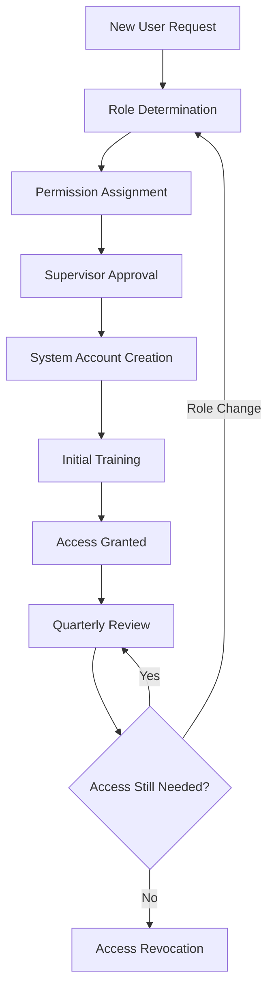
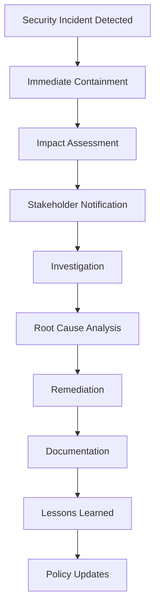

# Security Architecture - E-Lingkod Dasol HRIS

**Document Version**: 1.0  
**Date**: July 4, 2025  
**Architect**: Development Team  
**Approved By**: Mr. Bryan Navalta Balaoing (Data Protection Officer)

## Overview

This document describes the comprehensive security architecture implemented to protect employee personal data and ensure compliance with Philippine Data Privacy Act requirements in the E-Lingkod Dasol Human Resource Information System.

### Security Objectives
- **Confidentiality**: Ensure only authorized personnel can access employee data
- **Integrity**: Maintain accuracy and completeness of all HR data
- **Availability**: Ensure HRIS remains accessible during business hours
- **Accountability**: Track all data access and modifications
- **Compliance**: Meet Philippine Data Privacy Act and CSC requirements

## Multi-Layer Security Model

The E-Lingkod Dasol HRIS implements a comprehensive defense-in-depth security model with multiple layers of protection:

```
┌─────────────────────────────────────────┐
│            User Interface Layer        │ ← Role-based navigation & UI controls
├─────────────────────────────────────────┤
│          Authentication Layer          │ ← Laravel Breeze + Session Security
├─────────────────────────────────────────┤
│          Authorization Layer           │ ← Spatie Permissions + Custom Policies
├─────────────────────────────────────────┤
│           Controller Layer             │ ← Role-based access control & filtering
├─────────────────────────────────────────┤
│           Service Layer                │ ← Data filtering by user role & context
├─────────────────────────────────────────┤
│            Model Layer                 │ ← Query scopes & data validation
├─────────────────────────────────────────┤
│           Database Layer               │ ← Encrypted sensitive data & indexes
├─────────────────────────────────────────┤
│            Audit Layer                 │ ← Comprehensive activity logging
└─────────────────────────────────────────┘
```

### Layer Descriptions

#### **1. User Interface Layer**
- **Purpose**: Provide role-appropriate interface elements
- **Components**: Navigation menus, form fields, action buttons
- **Security Features**:
  - Dynamic menu generation based on user permissions
  - Hidden UI elements for unauthorized functions
  - Client-side validation with server-side verification
  - CSRF token implementation in all forms

#### **2. Authentication Layer**
- **Purpose**: Verify user identity before system access
- **Implementation**: Laravel Breeze authentication framework
- **Security Features**:
  - Strong password requirements (minimum 8 characters, complexity rules)
  - Session timeout and automatic logout
  - Account lockout after failed attempts
  - Remember token security
  - Session regeneration on login

#### **3. Authorization Layer**
- **Purpose**: Determine what authenticated users can access
- **Implementation**: Spatie Laravel-Permission package + custom policies
- **Security Features**:
  - Role-based access control (RBAC)
  - Granular permission system
  - Policy-driven authorization checks
  - Dynamic permission evaluation

#### **4. Controller Layer**
- **Purpose**: Handle HTTP requests with security enforcement
- **Implementation**: Laravel controllers with middleware and policies
- **Security Features**:
  - Automatic authorization checks
  - Input validation and sanitization
  - Rate limiting for API endpoints
  - Request logging and monitoring

#### **5. Service Layer**
- **Purpose**: Implement business logic with data filtering
- **Implementation**: Custom service classes with security-aware methods
- **Security Features**:
  - User context-aware data filtering
  - Automatic scope application
  - Privacy violation detection
  - Audit trail generation

#### **6. Model Layer**
- **Purpose**: Data access with built-in security constraints
- **Implementation**: Eloquent models with custom scopes and observers
- **Security Features**:
  - Query scopes for automatic filtering
  - Model observers for audit logging
  - Mass assignment protection
  - Soft deletes for data preservation

#### **7. Database Layer**
- **Purpose**: Secure data storage and retrieval
- **Implementation**: MySQL with encryption and indexing
- **Security Features**:
  - Sensitive data encryption at rest
  - Proper indexing for performance
  - Database connection security
  - Regular backup encryption

#### **8. Audit Layer**
- **Purpose**: Comprehensive activity tracking and compliance
- **Implementation**: Spatie ActivityLog + custom audit service
- **Security Features**:
  - All data access logging
  - Privacy violation detection
  - Immutable audit records
  - Compliance reporting

## Role-Based Access Control (RBAC) Implementation

### User Role Hierarchy

```
Super Admin
    ├── Full system administration access
    ├── User management capabilities
    ├── System configuration access
    └── Complete audit trail access
        │
        ├── HR Admin
        │   ├── All employee data access (for HR purposes)
        │   ├── Document approval processing
        │   ├── Report generation capabilities
        │   └── Performance management access
        │       │
        │       └── Employee
        │           ├── Own profile access only
        │           ├── Personal document requests
        │           ├── Own leave applications
        │           └── Individual performance data
```

### Permission Matrix

| Permission | Employee | HR Admin | Super Admin |
|------------|----------|----------|-------------|
| **Employee Data** |  |  |  |
| `employee.view-own` | ✅ | ✅ | ✅ |
| `employee.update-own` | ✅ (limited) | ✅ | ✅ |
| `employee.view` | ❌ | ✅ | ✅ |
| `employee.create` | ❌ | ✅ | ✅ |
| `employee.update` | ❌ | ✅ | ✅ |
| `employee.delete` | ❌ | ❌ | ✅ |
| **Leave Management** |  |  |  |
| `leave.view-own` | ✅ | ✅ | ✅ |
| `leave.create` | ✅ | ✅ | ✅ |
| `leave.view` | ❌ | ✅ | ✅ |
| `leave.approve` | ❌ | ✅ | ✅ |
| **Document Approvals** |  |  |  |
| `document-approval.view-own` | ✅ | ✅ | ✅ |
| `document-approval.create` | ✅ | ✅ | ✅ |
| `document-approval.view` | ❌ | ✅ | ✅ |
| `document-approval.process` | ❌ | ✅ | ✅ |
| **Performance Management** |  |  |  |
| `performance.view-own` | ✅ | ✅ | ✅ |
| `performance.update-own` | ✅ | ✅ | ✅ |
| `performance.view` | ❌ | ✅ | ✅ |
| `performance.manage` | ❌ | ✅ | ✅ |
| **System Administration** |  |  |  |
| `user.manage` | ❌ | ❌ | ✅ |
| `system.configure` | ❌ | ❌ | ✅ |
| `audit.view` | ❌ | ✅ (limited) | ✅ |
| `backup.manage` | ❌ | ❌ | ✅ |

### Dynamic Permission Evaluation

The system uses dynamic permission evaluation to ensure security:

```php
// Example: Employee accessing profile data
if ($user->can('employee.view-own') && $employee->user_id === auth()->id()) {
    // Allow access to own profile
    return $this->showProfile($employee);
}

// Example: HR Admin accessing employee data
if ($user->can('employee.view') && $user->hasRole('HR Admin')) {
    // Allow access to employee data for HR purposes
    activity()->log('HR Admin accessed employee profile');
    return $this->showProfile($employee);
}
```

## Data Protection Measures

### Privacy by Design Implementation

#### **1. Proactive Not Reactive**
- Security controls prevent privacy violations before they occur
- Automatic data filtering based on user role
- Privacy violation detection and immediate blocking

#### **2. Privacy as the Default Setting**
- System defaults to most restrictive access permissions
- Employees can only see own data unless explicitly authorized
- New users receive minimal necessary permissions

#### **3. Full Functionality**
- Privacy protection doesn't compromise administrative efficiency
- HR functions remain fully operational with appropriate safeguards
- Performance optimization maintains security requirements

#### **4. End-to-End Security**
- Security measures cover entire data lifecycle
- From data collection through processing to deletion
- Consistent protection across all system components

#### **5. Visibility and Transparency**
- All processing activities logged and auditable
- Clear privacy notices and data handling information
- Regular compliance reporting and assessment

#### **6. Respect for User Privacy**
- Employee privacy rights fully supported
- Data subject request handling automation
- Privacy-preserving system design choices

### Technical Security Implementation

#### **Authentication Security**

```php
// Strong password requirements
'password' => [
    'required',
    'string',
    'min:8',
    'regex:/^(?=.*[a-z])(?=.*[A-Z])(?=.*\d)(?=.*[@$!%*?&])[A-Za-z\d@$!%*?&]/',
    'confirmed'
],

// Session security configuration
'lifetime' => 120, // 2 hours
'expire_on_close' => true,
'encrypt' => true,
'http_only' => true,
'same_site' => 'lax'
```

#### **Data Encryption**

```php
// Sensitive field encryption
protected $casts = [
    'salary' => 'encrypted',
    'bank_account' => 'encrypted',
    'government_id' => 'encrypted'
];

// HTTPS enforcement
if (! $request->secure() && app()->environment('production')) {
    return redirect()->secure($request->getRequestUri());
}
```

#### **Input Validation and Sanitization**

```php
// Comprehensive validation rules
public function rules(): array
{
    return [
        'full_name' => 'required|string|max:255|regex:/^[\pL\s\-\.]+$/u',
        'email' => 'required|email|unique:users,email,' . $this->user_id,
        'contact_number' => 'required|regex:/^[\+]?[0-9\-\(\)\s]+$/',
        'employee_number' => 'required|unique:employees,employee_number'
    ];
}
```

#### **SQL Injection Prevention**

```php
// Parameterized queries (Eloquent automatically handles this)
$employees = Employee::where('department_id', $departmentId)
                    ->where('status', 'active')
                    ->get();

// Raw queries with parameter binding when necessary
$results = DB::select(
    'SELECT * FROM employees WHERE created_at BETWEEN ? AND ?',
    [$startDate, $endDate]
);
```

### Organizational Security Measures

#### **Access Management Process**



#### **Incident Response Workflow**



## Audit and Compliance Framework

### Comprehensive Audit Logging

The system implements comprehensive audit logging using the Spatie ActivityLog package enhanced with custom audit services:

#### **Logged Activities**

```php
// Employee data access
activity('employee_access')
    ->performedOn($employee)
    ->causedBy(auth()->user())
    ->withProperties([
        'accessed_fields' => $accessedFields,
        'access_purpose' => 'HR Administration',
        'ip_address' => request()->ip(),
        'user_agent' => request()->userAgent()
    ])
    ->log('Employee profile accessed');

// Privacy violation detection
activity('privacy_violation')
    ->causedBy(auth()->user())
    ->withProperties([
        'attempted_access' => $attemptedResource,
        'violation_type' => 'Unauthorized employee data access',
        'blocked_action' => $blockedAction,
        'risk_level' => 'HIGH'
    ])
    ->log('Privacy violation blocked');
```

#### **Audit Data Structure**

| Field | Description | Example |
|-------|-------------|---------|
| `log_name` | Category of activity | `employee_access`, `privacy_violation` |
| `description` | Human-readable description | "Employee profile accessed" |
| `subject_type` | Type of object acted upon | `App\Models\Employee` |
| `subject_id` | ID of the object | `123` |
| `causer_type` | Type of user performing action | `App\Models\User` |
| `causer_id` | ID of the user | `456` |
| `properties` | Additional metadata | JSON object with context |
| `created_at` | Timestamp of activity | `2025-07-04 10:30:15` |

### Privacy Violation Detection

The system includes automated privacy violation detection:

```php
class PrivacyViolationDetector
{
    public function detectViolation($user, $attemptedAction, $targetResource)
    {
        // Check if employee trying to access other employee data
        if ($user->hasRole('Employee') && $this->isUnauthorizedAccess($user, $targetResource)) {
            $this->logViolation($user, $attemptedAction, $targetResource);
            $this->sendAlert($user, $attemptedAction);
            throw new PrivacyViolationException('Access denied: Privacy violation detected');
        }
    }
    
    private function isUnauthorizedAccess($user, $resource)
    {
        // Employee trying to access other employee's data
        if ($resource instanceof Employee && $resource->user_id !== $user->id) {
            return true;
        }
        
        // Employee trying to access admin-only resources
        if ($this->isAdminResource($resource) && !$user->hasRole(['HR Admin', 'Super Admin'])) {
            return true;
        }
        
        return false;
    }
}
```

### Compliance Monitoring

#### **Real-time Monitoring Dashboard**

```php
// Dashboard metrics for compliance monitoring
class ComplianceMetrics
{
    public function getPrivacyMetrics()
    {
        return [
            'privacy_violations_today' => $this->getViolationsCount(today()),
            'unauthorized_access_attempts' => $this->getUnauthorizedAttempts(),
            'data_subject_requests_pending' => $this->getPendingRequests(),
            'compliance_score' => $this->calculateComplianceScore()
        ];
    }
    
    public function generateComplianceReport($period)
    {
        return [
            'total_data_access_events' => Activity::whereBetween('created_at', $period)->count(),
            'privacy_violations' => Activity::where('log_name', 'privacy_violation')->count(),
            'employee_data_access' => Activity::where('log_name', 'employee_access')->count(),
            'user_activity_summary' => $this->getUserActivitySummary($period)
        ];
    }
}
```

## Performance and Scalability

### Database Optimization

#### **Indexing Strategy**

```sql
-- Performance-critical indexes
CREATE INDEX idx_employees_user_id ON employees(user_id);
CREATE INDEX idx_employees_department_status ON employees(department_id, status);
CREATE INDEX idx_activity_log_causer ON activity_log(causer_id, created_at);
CREATE INDEX idx_activity_log_subject ON activity_log(subject_type, subject_id);
CREATE INDEX idx_document_requests_employee ON document_approval_requests(employee_id, status);
CREATE INDEX idx_leave_applications_employee ON leave_applications(employee_id, status);

-- Security-focused indexes
CREATE INDEX idx_activity_log_security ON activity_log(log_name, created_at) 
    WHERE log_name IN ('privacy_violation', 'security_incident');
```

#### **Query Optimization**

```php
// Optimized queries with eager loading
$employees = Employee::with(['user', 'department'])
    ->whereHas('user', function($query) {
        $query->where('status', 'active');
    })
    ->orderBy('created_at', 'desc')
    ->paginate(20);

// Scoped queries for security
class Employee extends Model
{
    public function scopeAccessibleBy($query, User $user)
    {
        if ($user->hasRole('Employee')) {
            return $query->where('user_id', $user->id);
        }
        
        if ($user->hasRole('HR Admin')) {
            return $query; // HR Admin can access all
        }
        
        return $query->whereNull('id'); // Default: no access
    }
}
```

### Caching Strategy

```php
// Role-based caching
class CacheService
{
    public function getEmployeeData($userId, $requestingUser)
    {
        $cacheKey = "employee_data_{$userId}_for_{$requestingUser->id}";
        
        return Cache::remember($cacheKey, 3600, function() use ($userId, $requestingUser) {
            return Employee::accessibleBy($requestingUser)
                ->where('user_id', $userId)
                ->first();
        });
    }
    
    public function invalidateUserCache($userId)
    {
        // Clear all cached data for specific user
        $pattern = "employee_data_{$userId}_*";
        $this->clearByPattern($pattern);
    }
}
```

## Security Testing and Validation

### Automated Security Testing

The system includes comprehensive automated security testing:

```php
// Privacy protection tests
class PrivacyProtectionTest extends TestCase
{
    public function test_employee_cannot_access_other_employee_data()
    {
        $employee = User::factory()->create()->assignRole('Employee');
        $otherEmployee = Employee::factory()->create();
        
        $response = $this->actingAs($employee)
            ->get("/employees/{$otherEmployee->id}");
        
        $response->assertStatus(403);
        $this->assertDatabaseHas('activity_log', [
            'log_name' => 'privacy_violation',
            'causer_id' => $employee->id
        ]);
    }
}
```

### Security Monitoring

```php
// Real-time security monitoring
class SecurityMonitor
{
    public function monitorSuspiciousActivity()
    {
        // Multiple failed login attempts
        $this->detectBruteForceAttempts();
        
        // Unusual access patterns
        $this->detectAnomalousAccess();
        
        // Privacy violation patterns
        $this->detectPrivacyViolationPatterns();
        
        // System compromise indicators
        $this->detectSystemCompromise();
    }
    
    private function detectPrivacyViolationPatterns()
    {
        $violations = Activity::where('log_name', 'privacy_violation')
            ->where('created_at', '>', now()->subHour())
            ->groupBy('causer_id')
            ->havingRaw('COUNT(*) > 5')
            ->get();
            
        foreach ($violations as $violation) {
            $this->alertAdministrators($violation);
            $this->considerAccountSuspension($violation->causer_id);
        }
    }
}
```

## Business Continuity and Disaster Recovery

### Backup Strategy

```php
// Automated backup system
class BackupService
{
    public function performDailyBackup()
    {
        // Database backup
        $this->backupDatabase();
        
        // File system backup
        $this->backupFiles();
        
        // Configuration backup
        $this->backupConfiguration();
        
        // Encrypt all backups
        $this->encryptBackups();
        
        // Verify backup integrity
        $this->verifyBackups();
        
        // Archive old backups
        $this->archiveOldBackups();
    }
    
    private function encryptBackups()
    {
        $backups = glob(storage_path('backups/*.sql'));
        foreach ($backups as $backup) {
            $encrypted = Crypt::encrypt(file_get_contents($backup));
            file_put_contents($backup . '.enc', $encrypted);
            unlink($backup); // Remove unencrypted version
        }
    }
}
```

### Recovery Procedures

```php
// Disaster recovery automation
class DisasterRecovery
{
    public function initiateRecovery($backupDate)
    {
        // 1. Assess system status
        $this->assessSystemDamage();
        
        // 2. Secure the environment
        $this->secureEnvironment();
        
        // 3. Restore from backup
        $this->restoreFromBackup($backupDate);
        
        // 4. Verify data integrity
        $this->verifyDataIntegrity();
        
        // 5. Test system functionality
        $this->testSystemFunctionality();
        
        // 6. Resume operations
        $this->resumeOperations();
        
        // 7. Conduct post-incident review
        $this->conductPostIncidentReview();
    }
}
```

## Integration Security

### API Security

```php
// API security implementation
class ApiSecurity
{
    public function secureApiEndpoint($request)
    {
        // Rate limiting
        $this->enforceRateLimit($request);
        
        // Authentication verification
        $this->verifyAuthentication($request);
        
        // Authorization check
        $this->checkAuthorization($request);
        
        // Input validation
        $this->validateInput($request);
        
        // Data filtering based on user role
        return $this->filterResponseData($request);
    }
    
    private function filterResponseData($request)
    {
        $user = $request->user();
        $data = $this->getData();
        
        if ($user->hasRole('Employee')) {
            // Filter to show only user's own data
            return $data->where('user_id', $user->id);
        }
        
        return $data; // HR Admin and Super Admin see all data
    }
}
```

### Third-Party Integration Security

```php
// Secure third-party integrations
class ThirdPartyIntegration
{
    public function secureIntegration($vendor, $data)
    {
        // Vendor authentication
        $this->authenticateVendor($vendor);
        
        // Data minimization
        $filteredData = $this->minimizeData($data);
        
        // Encryption for transmission
        $encryptedData = $this->encryptForTransmission($filteredData);
        
        // Audit logging
        $this->logDataSharing($vendor, $filteredData);
        
        return $this->transmitSecurely($vendor, $encryptedData);
    }
}
```

## Future Security Enhancements

### Planned Improvements

1. **Advanced Threat Detection**
   - Machine learning-based anomaly detection
   - Behavioral analysis for insider threat detection
   - Advanced persistent threat (APT) monitoring

2. **Enhanced Authentication**
   - Multi-factor authentication for all users
   - Biometric authentication options
   - Single sign-on (SSO) integration

3. **Data Loss Prevention**
   - Advanced DLP solutions
   - Email and file transfer monitoring
   - Watermarking and tracking of sensitive documents

4. **Privacy-Enhancing Technologies**
   - Data anonymization and pseudonymization
   - Differential privacy for analytics
   - Homomorphic encryption for processing

### Security Roadmap

| Quarter | Enhancement | Priority |
|---------|-------------|----------|
| Q3 2025 | Multi-factor authentication rollout | HIGH |
| Q4 2025 | Advanced audit analytics | MEDIUM |
| Q1 2026 | Behavioral analysis system | HIGH |
| Q2 2026 | Data anonymization framework | MEDIUM |
| Q3 2026 | Advanced threat detection | HIGH |

---

**Document Control**
- **Version**: 1.0
- **Created**: July 4, 2025
- **Last Updated**: July 4, 2025
- **Next Review**: January 4, 2026
- **Classification**: Internal Technical Documentation

*This security architecture document provides comprehensive technical details about the E-Lingkod Dasol HRIS security implementation. It should be reviewed and updated regularly to reflect system changes and emerging security threats.*